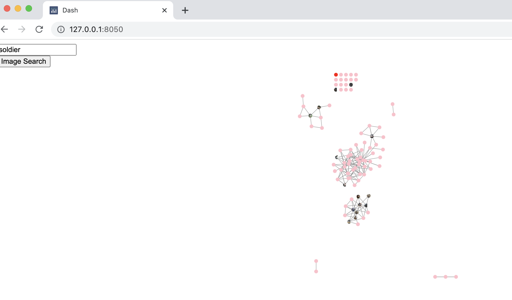
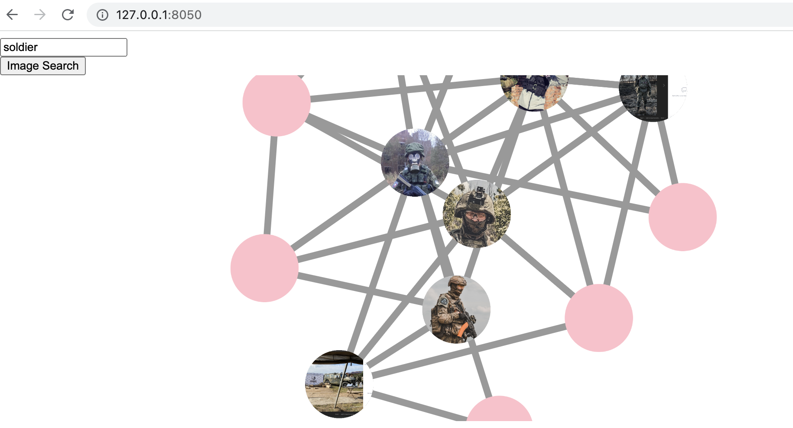
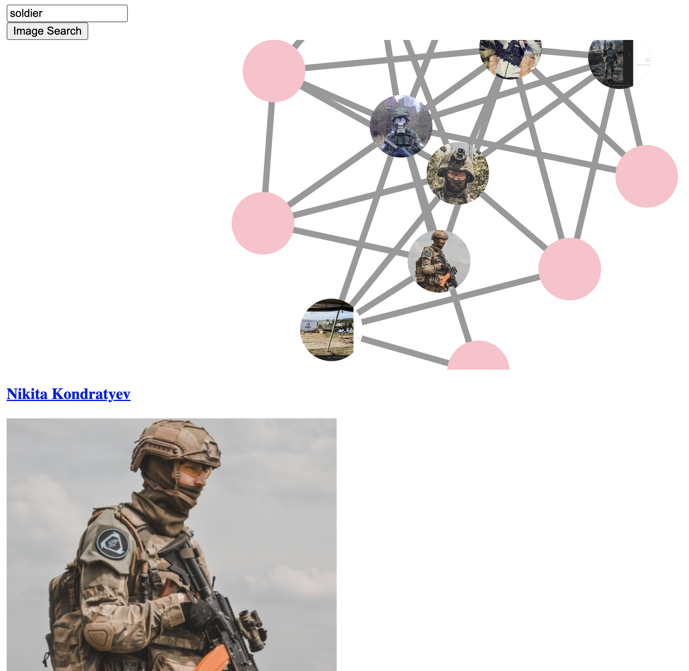

# SocNet Dynamic Image Search
Automatically identify and highlight targets (Russian soldiers, right-wing extremists etc) in visualized social networks

## Team Members
UlyssesNYC
https://medium.com/@DataSalo

## Tool Description
This sections discusses the purpose and motivation for the tool, and how it addresses a tool need you've identified.

## Installation

1. Make sure you have Python version 3.8 or greater installed

2. Download the tool's repository using the command:

        git clone https://github.com/DataSalo/SocNet_Dynamic_Image_Search.git

3. Move to the tool's directory and install the necessary requirement

        cd SocNet_Dynamic_Image_Search
        pip install -r requirements.txt
4. For those users who also wish to carry out a Selenium driven friend-of-a-friend VK search, please follow the instructions [here](https://selenium-python.readthedocs.io/installation.html) for Selenium driver installation

## Usage
### Socnet App Usage for Network Visualization with Dynamic Image Search
1. Go to `SocNet_Dynamic_Image_Search/code` and run `python socnet_app.py`.
2. Go to http://127.0.0.1:8050/ in your browser to display the precomputed network whose id is stored `cached_network_id.txt` (how to compute and cache new networks is dicussed later.
3. The network is visualized but none of the people nodes are labeled. Run a an image search on the upper-left corner of the screen for a photo category of interest such as "soldier", "guns", "confederate flag" or "[man in cowboy hat](https://www.bellingcat.com/news/2022/08/05/tracking-the-faceless-killers-who-mutilated-and-executed-a-ukrainian-pow/)". 
4. The nodes with match photographs are now filled in with those photos.
5. Use the mouse to drag the network and zoom into the network cluster of interest.
6. Click any node to display the associated person's name, photograph, and social media profile link. 

### Crawling a Friend-of-a-Friend Social Network for an Individual VK ID
1. Go to `SocNet_Dynamic_Image_Search/code` and run `vk_foaf_crawler.py`.
2. Follow prompt to specify the VK id of the user whose friend-of-a-friend network we wish to crawl. The example id used in the demo was `414930480`.
3. Follow prompts to enter the email and password of an accessible VK account. 
4. The script will proceed to identify all friends of the user and then obtain existing links between friends. It will also download all recent posted images associated with these users.
5. The network will be cached locally. It will be assigned a network id associated with the specified VK account.
6. Altering the id in the `cached_network_id.txt` file will ensure that this cached network gets displayed when we activate the Socnet Visualization App.

#### Example I/O
```
Enter VK id (example: 414930480):
414930480

Enter VK email:
ulyssesnycc@gmail.com

Enter VK password:
password123

Scrapping central target
https://vk.com/id414930480
Scrapping friends of target
Identified 94 friends.
Scraping friend-of-a-friend network
Downloading images associated with the target and friends
Computing and caching the downloaded image embeddings.
Saving friend-of-a-friend network.
```

## Additional Information
1. My choice for utilizing Cytoscape.js was partially driven by its ability to handle embedded images within nodes; as well as easy callbacks between graph interactions and html surrounding the network (which allowed me display enlarged photos / profile info with each click). Other, more sophisticated tools don't always allow for this level of interaction.
2. Right now, the visualization tool requires that the network of interest be cached and stored locally under a specific network id. This is because the associated images and searchable image embeddings must also be stored locally. Currently, the cached network id must be specified within the `cached_network_id.txt` config file prior to app launch. Eventually, I'd like to make the cached networks accessible directly from the app; so that the user can seamlessly switch between multiple cached networks of choice.
3. Eventually, I'd like to split the VK friend-of-a-friend crawler into a separate repo. For those who are wondering why the crawler depends on something as cumbersome as Selenium, it is because it's much harder to crawl user-friends at scale using more streamlined tools like the Selenium API.
4. Eventually, I'd like to expand the repertoire of crawlers to other social networks (including Twitter / Instagram) in order to better align with investigator use-cases. 
